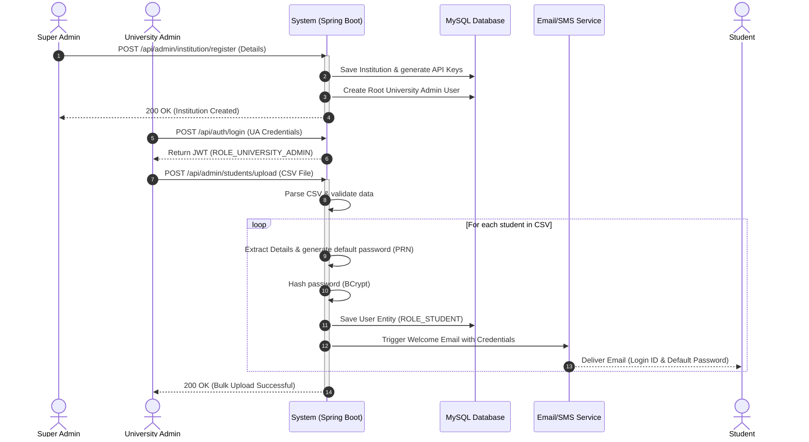
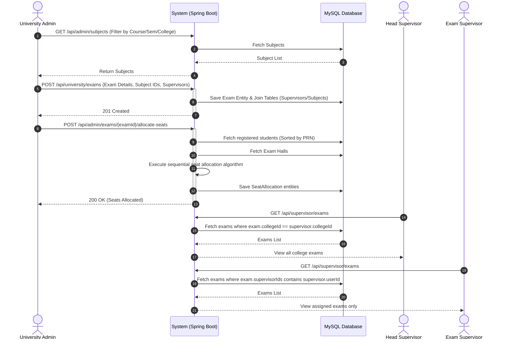
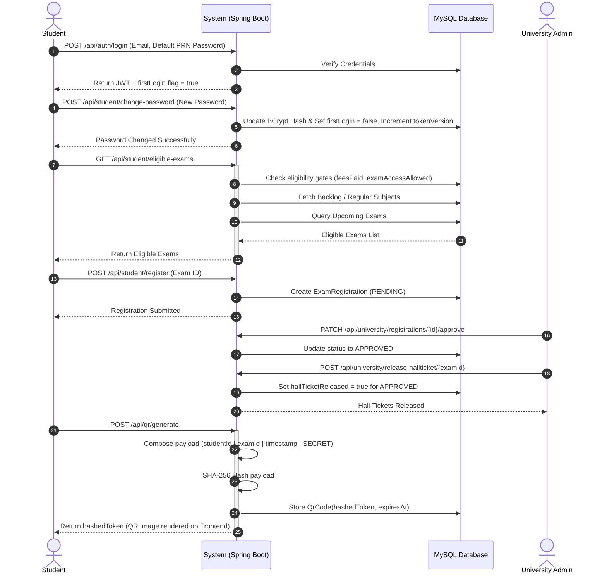
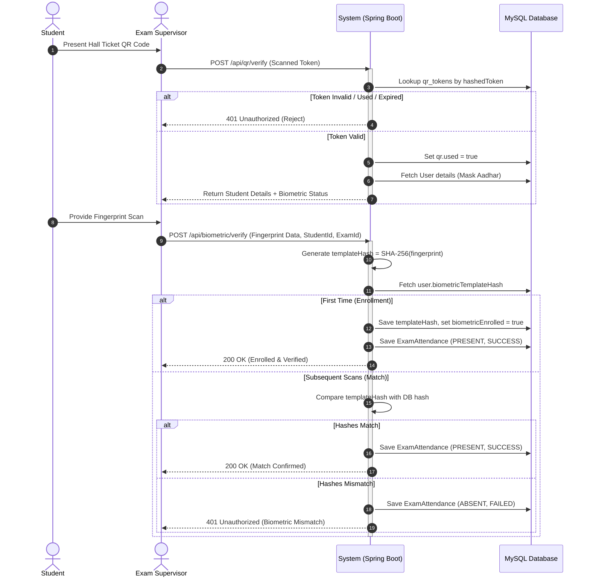

# Exam Authentication System: Detailed Sequence Diagrams

These sequence diagrams illustrate the core workflows of the Exam Authentication System. They are designed to be included in your project report to demonstrate the interaction between various system components, actors, and databases.

## 1. System Setup & User Onboarding Flow

This sequence outlines the process of a Super Admin onboarding an institution, followed by the University Admin enrolling students and setting up credentials.

## 2. Exam Creation & Pre-Exam Setup Flow

This sequence details how a University Admin creates an exam, assigns supervisors, and allocates seats.

## 3. Student Registration & Hall Ticket Flow

This diagram illustrates a student's journey from logging in (including the mandatory first-time password change) to registering for an exam and downloading a cryptographically secure hall ticket.

## 4. Exam Day Verification Flow (QR + Biometric)

This represents the high-security verification process at the exam hall entrance, involving QR scanning and biometric fingerprint matching.

